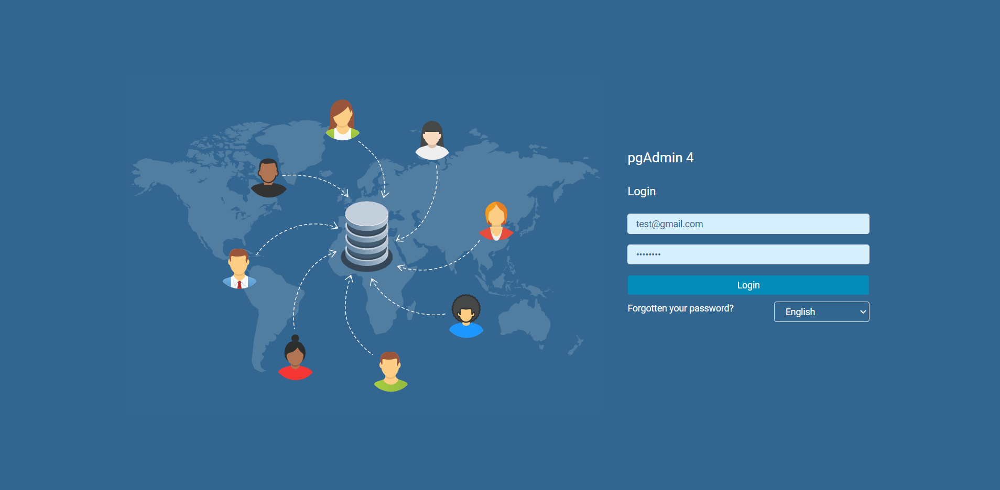

# Simple CQRS Implementation

Repositori ini merupakan hasil experiment penulis dalam mengimplementasikan CQRS Architecture

### Prerequisites

Sebelum mencoba repo ini alahkan baiknya dalam local host anda sudah terinstall :

1. OpenJDK 11
2. Kafka
3. Docker
4. Java IDE

### Cara Menggunakan Repo ini ?

1. Buka terminal dan ketik **docker-compose up -d** 

2. buka url http://localhost:16543/ dan masukan user dan password

   > **username:** test@gmail.com
   > **password:** test123!

   

   

   

3. 